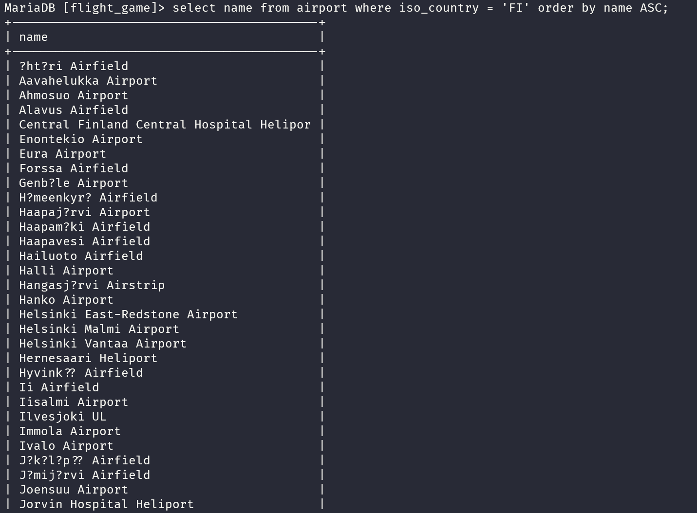
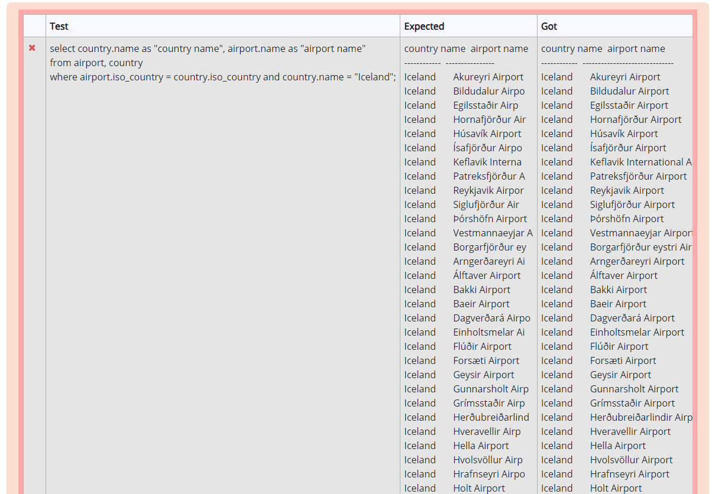
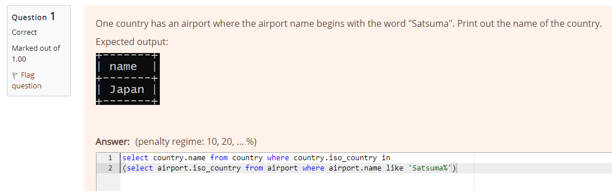

# Student: Unai San Segundo (2417471)
# Week 3:
### Exercises 2:
#### Question 1:
select * from goal;


#### Question 2:
select name, type from airport where iso_country = "FI";


#### Question 3:
select name from airport where iso_country = 'FI' order by name ASC;



#### Question 4:
select name, type from airport where iso_country = 'FI' order by type, name;


#### Question 5:
select name from country where name like 'F%';


#### Question 6:
select name from country where name LIKE '%f%';


#### Question 7:
select location from game where screen_name = 'Vesa';


#### Question 8:
select co2_consumed from game where screen_name = 'Ilkka';


#### Question 9:
select co2_budget from game limit 1;


#### Question 10:
select screen_name,co2_budget,co2_consumed, co2_budget-co2_consumed AS co2left from game where screen_name = 'Ilkka';


### Exercises 3:
#### Question 1:
select country.name as 'country name', airport.name as 'airport name'
from airport, country
where airport.iso_country = country.iso_country and airport.iso_country = 'IS';



#### Question 2:
select airport.name as 'airport name'
from airport, country
where airport.iso_country = country.iso_country
and airport.iso_country = 'FR' and airport.type = 'large_airport';


#### Question 3:
select country.name as 'country name', airport.name as 'airport name'
from airport, country 
where airport.iso_country = country.iso_country 
and airport.iso_country = 'AQ';


#### Question 4:
select airport.elevation_ft
from airport, game
where airport.ident = game.location and game.screen_name = 'Heini';


#### Question 5:
select airport.elevation_ft * 0.3048 as elevation_m
from airport, game
where airport.ident = game.location and game.screen_name = 'Heini';


#### Question 6:
select airport.name
from airport, game
where airport.ident = game.location and game.screen_name = 'Ilkka';


#### Question 7:
select country.name
from airport, game, country
where airport.ident = game.location and airport.iso_country = country.iso_country and game.screen_name = 'Ilkka';


#### Question 8:
select goal.name
from goal_reached, game, goal
where goal.id = goal_reached.goal_id and goal_reached.game_id = game.id and game.screen_name = 'Heini';


#### Question 9:
select airport.name
from goal_reached, game, goal, airport
where airport.ident = game.location and goal.id = goal_reached.goal_id and goal_reached.game_id = game.id 
and game.screen_name = 'Ilkka' and goal.name = 'CLOUDS';


#### Question 10:
select country.name
from goal_reached, game, goal, airport, country
where airport.iso_country = country.iso_country and airport.ident = game.location 
and goal.id = goal_reached.goal_id and goal_reached.game_id = game.id 
and game.screen_name = 'Ilkka' and goal.name = 'CLOUDS';


# Week 4:
### Exercises 4:
#### Question 1:
select country.name, airport.name
from country inner join airport on airport.iso_country = country.iso_country
where airport.scheduled_service = 'yes' and country.name = 'Finland';


#### Question 2:
select game.screen_name, airport.name
from game inner join airport on airport.ident = game.location;


#### Question 3:


#### Question 4:
select airport.name, game.screen_name
from airport left join game on airport.ident = game.location
where airport.name like '%Hels%';


#### Question 5:
select goal.name, game.screen_name
from goal left join goal_reached on goal.id = goal_reached.goal_id
left join game on game.id = goal_reached.game_id;


### Exercises 5:
#### Question 1:
select country.name from country where country.iso_country in
(select airport.iso_country from airport where airport.name like 'Satsuma%');



#### Question 2:
select airport.name from airport where airport.iso_country in
(select country.iso_country from country where country.name = 'Monaco');


#### Question 3:
select game.screen_name from game where game.id in
(select goal_reached.game_id from goal_reached where goal_reached.goal_id in
(select goal.id from goal where goal.name = 'CLOUDS'));


#### Question 4:
select country.name from country where country.iso_country not in
(select airport.iso_country from airport);


#### Question 5:
select goal.name from goal where goal.id not in
(select goal_reached.goal_id from goal_reached where goal_reached.game_id in
(select game.id from game where game.screen_name = 'Heini'));


# Week 5:
### Exercises 6:
#### Question 1:
```
select max(elevation_ft) from airport;
```


#### Question 2:
```
select continent, count(*) from country group by continent;
```


#### Question 3:
```
select game.screen_name, count(*) from goal_reached 
inner join game on game.id = goal_reached.game_id group by game.screen_name;
```


#### Question 4:
```
select game.screen_name from game where game.co2_consumed = 
(select min(co2_consumed) from game);
```


#### Question 5:
```
select country.name, count(*) from airport inner join country on airport.iso_country = country.iso_country 
group by country.iso_country order by count(*) desc limit 50;
```


#### Question 6:
```
select country.name from airport inner join country on airport.iso_country = country.iso_country 
group by country.iso_country having count(*)>1000;
```


#### Question 7:
```
select airport.name from airport where airport.elevation_ft =
(select max(elevation_ft) from airport);
```


#### Question 8:
```

```

#### Question 9:
```

```

#### Question 10:
```

```


